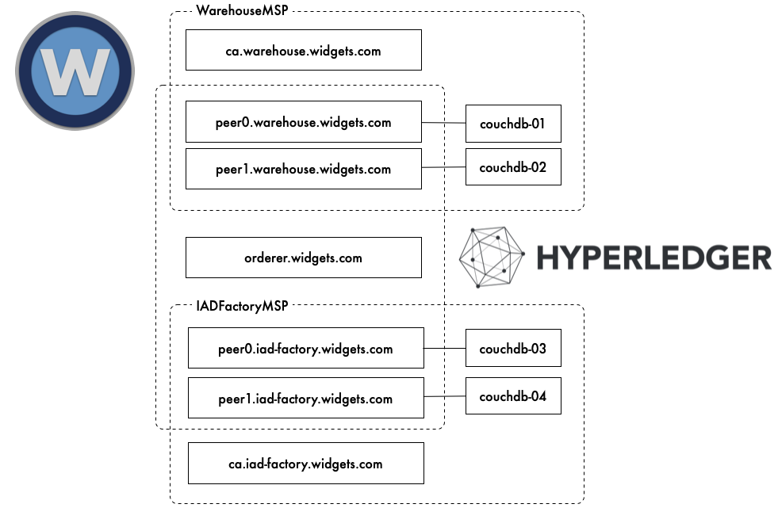

## Inventory Tracker

This project contains a proof of concept implementation for an inventory tracking system for a ficticious organization: __widgets.org__.
[Hyperledger Fabric](https://www.hyperledger.org/projects/fabric) provides the underlying blockchain implementation. Additionally, this 
project provides the following capabilities:

* Fetch inventory from Blockchain
* Fetch an inventory item (and history) from Blockchain
* Insert a new inventory item
* Transfer an inventory item between facilities (e.g. IADFactory => Warehouse)
* Mark an inventory item as unavailable (e.g. installed)

### Blockchain Network



### Project Structure

<dl>
    <dt>chaincode</dt>
    <dd>contains the blockchain code that will be deployed to the network</dd>
    <dt>network</dt>
    <dd>contains the scripts and template files to manage the network</dd>
    <dt>service</dt>
    <dd>contains the web api</dd>
    <dt>ui</dt>
    <dd>contains the web ui</dd>
</dl>

### Deployment

To build and deploy this project, you should be running on a *NIX-compatible machine with at least the following software installed:

* [Go v.1.12+](https://golang.org/doc/install)
* [NodeJS v12+](https://nodejs.org/en/)
* [Docker](https://docs.docker.com/install/)

#### Network

To bring the blockchain network online, run the following command:

```bash
$ make netup
```

#### Web API

To serve the Web API/UI, run the following command:

```bash    
$ make run
```

### Inventory Data

The inventory data was imported from [Datasn.io](http://n3.datasn.io/data/api/v1/n3a2/auto_part_2/main/list/?app=csv&cfg[download]=1) with
randomized quantities and bogus serial numbers.
